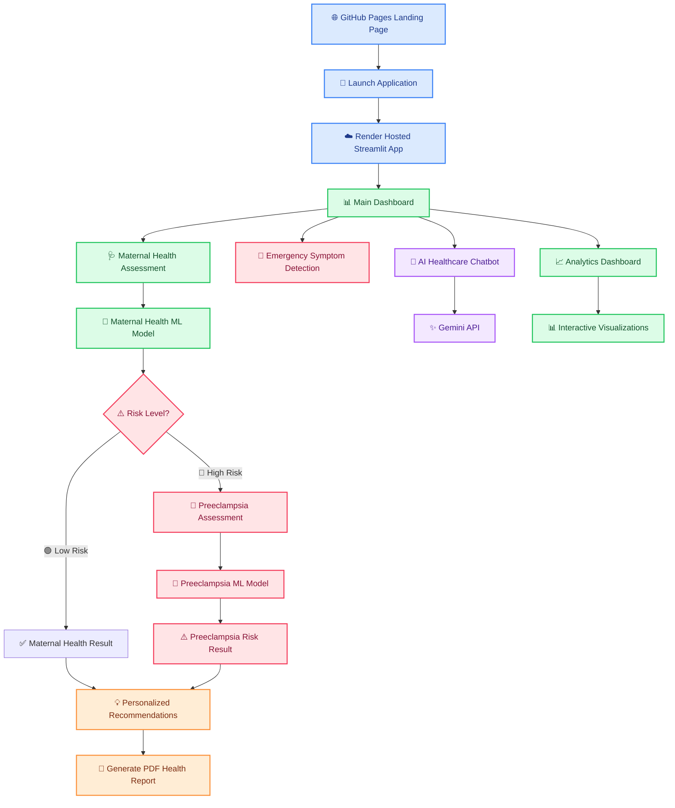

# Prediction of Preeclampsia Using Machine Learning Approaches

<div align="center">

### AI-Powered Maternal Health & Preeclampsia Risk Assessment System

A Machine Learning-based healthcare application for maternal health risk assessment, preeclampsia prediction, interactive analytics, and AI-assisted healthcare support.

<br>


</div>

---
<div align="center">
    
## 🚀 Live Demo

🌐 **Landing Page**  
https://priyankalisa.github.io/maternal-health-preeclampsia-system/

🏥 **Streamlit Application**  
https://maternal-health-preeclampsia-system.onrender.com/

</div>

---
# 🌟 Project Overview

The **Prediction of Preeclampsia Using Machine Learning Approaches** is an AI-powered healthcare application designed to support the early identification of maternal health risks and preeclampsia during pregnancy.

The platform combines **Machine Learning**, **Generative AI**, and **Interactive Analytics** to provide a complete healthcare screening experience through a user-friendly web interface.

---

## 🏥 What Does the System Do?

🔹 Assess Overall Maternal Health Risk

🔹 Identify High-Risk Pregnancies Using Machine Learning

🔹 Perform Secondary Preeclampsia Risk Assessment

🔹 Generate Downloadable Patient Health Reports (PDF)

🔹 Provide AI-Powered Healthcare Assistance via Gemini

🔹 Generate Personalized Healthcare Recommendations

🔹 Detect Emergency Warning Symptoms

🔹 Visualize Risk Through Interactive Dashboards

---

## 🔄 Assessment Workflow

### 🩺 Step 1: Maternal Health Assessment

Users enter maternal health information and clinical parameters.

### 🤖 Step 2: Maternal Health Risk Prediction

The Machine Learning model evaluates overall maternal health risk.

### ⚠️ Step 3: High-Risk Screening

If the patient is identified as **High Risk**, the system activates the second assessment stage.

### 🏥 Step 4: Preeclampsia Prediction

A dedicated Machine Learning model predicts preeclampsia risk using additional healthcare information.

### 💡 Step 5: Healthcare Recommendations

Personalized recommendations are generated based on the prediction outcome.

---

## 🎯 Problem Statement

Maternal health complications remain a major healthcare challenge worldwide.

Among these complications, **Preeclampsia** is one of the most serious pregnancy-related disorders and can lead to severe maternal and fetal complications if not detected early.

### Key Challenges

- ❌ Delayed Diagnosis
- ❌ Limited Healthcare Access
- ❌ Insufficient Monitoring
- ❌ Lack of Risk Awareness
- ❌ Delayed Medical Intervention

This project applies Machine Learning techniques to support early risk identification and healthcare awareness.

---

## 🎯 Objectives

- ✅ Predict maternal health risk using clinical indicators
- ✅ Predict preeclampsia risk for high-risk pregnancies
- ✅ Support early healthcare screening
- ✅ Provide AI-powered healthcare assistance
- ✅ Deliver personalized recommendations
- ✅ Visualize healthcare insights through analytics
- ✅ Demonstrate real-world healthcare AI applications

---

## 🚀 Key Features

| Feature | Description |
|----------|-------------|
| 🩺 Maternal Health Risk Assessment | Predicts maternal health risk using clinical and pregnancy-related parameters |
| ⚠️ Preeclampsia Risk Prediction | Performs secondary preeclampsia screening for high-risk pregnancies |
| 📄 PDF Report Generation | Generates downloadable patient health assessment reports |
| 💬 AI Healthcare Chatbot | Gemini-powered healthcare assistant for maternal health guidance |
| 🚨 Emergency Symptom Detection | Identifies critical warning symptoms requiring immediate medical attention |
| 💡 Personalized Recommendations | Provides risk-specific healthcare recommendations and preventive guidance |
| 📊 Interactive Analytics Dashboard | Visualizes healthcare insights through charts and analytics |
| 📈 Risk Visualization | Displays prediction outcomes using interactive gauge indicators |
| 🔄 Dual-Stage Assessment Workflow | Maternal Health Assessment → High-Risk Screening → Preeclampsia Assessment |
| 🌐 GitHub Pages Landing Site | Professional project landing page with system overview |
| ☁️ Cloud Deployment | Streamlit application deployed on Render |
| 📱 Responsive Design | Optimized for desktop, tablet, and mobile devices |

---

# 🧠 Machine Learning Pipeline Diagram

```mermaid
flowchart LR

A[📊 Raw Dataset] --> B[🧹 Data Cleaning]
B --> C[🧠 Feature Engineering]
C --> D[⚙️ Data Preprocessing]
D --> E[✂️ Train-Test Split]
E --> F[🤖 Model Training]
F --> G[📈 Model Evaluation]
G --> H[🏆 Model Selection]
H --> I[💾 Model Serialization]
I --> J[🚀 Streamlit Deployment]
J --> K[🔮 User Predictions]

%% Styling
classDef data fill:#FFEDD5,stroke:#FB923C,stroke-width:2px,color:#7C2D12;
classDef process fill:#DBEAFE,stroke:#3B82F6,stroke-width:2px,color:#1E3A8A;
classDef model fill:#DCFCE7,stroke:#22C55E,stroke-width:2px,color:#14532D;
classDef deploy fill:#F3E8FF,stroke:#A855F7,stroke-width:2px,color:#4C1D95;

class A,B data;
class C,D,E,F,G,H model;
class I,J,K deploy;
```



---

# 📊 Input Parameters

## 🩺 Maternal Health Features

| Feature | Description |
|----------|-------------|
| Age | Patient age |
| Gravida | Number of pregnancies |
| Weight | Body weight |
| Height | Height |
| Gestation Period | Pregnancy duration |
| Blood Pressure | Systolic & Diastolic BP |
| Anemia | Anemia condition |
| Albumin | Urine albumin status |
| Blood Sugar | Blood sugar level |
| Fetal Position | Baby position |
| Fetal Heart Beat | Fetal heart rate |
| Jaundice | Liver condition |
| VDRL | Infection indicator |
| HRsAG | Hepatitis indicator |

---

## 🫀 Preeclampsia Features

| Feature | Description |
|----------|-------------|
| Age | Maternal age in years |
| Gravidity | Total number of pregnancies |
| Gestational Age | Pregnancy duration in weeks |
| Pre-Pregnancy BMI | Body Mass Index before pregnancy |
| Systolic BP | Systolic blood pressure (mmHg) |
| Diastolic BP | Diastolic blood pressure (mmHg) |
| Hemoglobin | Hemoglobin level (g/dL) |
| Anemia Status | Presence or absence of anemia |
| Fasting Glucose | Fasting blood glucose level (mg/dL) |
| Proteinuria | Presence of protein in urine |
| HIV Status | HIV infection status |

---

## 📊 Datasets Used

👉 Dataset 1: Zenodo Maternal Health Dataset  
https://zenodo.org/records/14537882

👉 Dataset 2: Africa Synthetic Maternal Health Dataset  
https://huggingface.co/datasets/electricsheepafrica/africa-synth-maternal-health-maternal-health-pregnancy-all

### 📌 Description

- The **Zenodo Maternal Health Dataset** contains clinical and demographic information used for maternal health risk assessment and classification.

- The **Africa Synthetic Maternal Health Dataset** provides pregnancy-related healthcare indicators, laboratory measurements, maternal history, and risk factors that support preeclampsia risk prediction and high-risk pregnancy analysis.

### 📋 Dataset Usage in This Project

| Dataset | Purpose |
|----------|----------|
| Zenodo Maternal Health Dataset | Maternal Health Risk Prediction Model |
| Africa Synthetic Maternal Health Dataset | Preeclampsia Risk Prediction Model |
---

# 🏗️ System Architecture



---

# 📂 Project Structure

```bash
maternal-health-preeclampsia-system/
│
├── 🌐 app/
│   ├── 🚀 app.py
│   ├── 💬 chatbot.py
│   ├── ⚡ cache.py
│   ├── 📄 doctor_advice.json
│   │
│   └── 🤖 models/
│       ├── 📦 loader.py
│       ├── 🧠 maternal_health_model.pkl
│       └── ⚠️ preeclampsia_model.pkl
│
├── 🎨 .streamlit/
│   └── ⚙️ config.toml
│
├── 🧑‍💻 .vscode/
│   └── settings.json
│
├── 🌍 index.html
├── 📦 pyproject.toml
├── 🚀 render.yaml
├── 🔒 uv.lock
├── 📘 README.md
└── 🚫 .gitignore
```

## 📁 Directory Description

| 📂 File / Folder | 📌 Description |
|------------------|----------------|
| `.streamlit/config.toml` | ⚙️ Streamlit configuration file for UI theme, layout, and app settings |
| `.vscode/settings.json` | 🧑‍💻 VS Code workspace settings for consistent development environment |
| `app/app.py` | 🚀 Main Streamlit application handling UI, workflow, and predictions |
| `app/chatbot.py` | 💬 AI chatbot logic integrated with Gemini API for user interaction |
| `app/cache.py` | ⚡ Caching system to optimize performance and reduce repeated computations |
| `app/doctor_advice.json` | 📄 Contains medical advice, thresholds, and rule-based response data |
| `app/models/loader.py` | 📦 Utility script to load trained ML models into the application |
| `app/models/maternal_health_model.pkl` | 🧠 Trained ML model for maternal health risk prediction (Phase 1) |
| `app/models/preeclampsia_model.pkl` | ⚠️ Trained ML model for preeclampsia risk prediction (Phase 2) |
| `index.html` | 🌐 Landing page for GitHub Pages (frontend entry point) |
| `pyproject.toml` | 📦 Project dependencies, metadata, and build configuration |
| `render.yaml` | 🚀 Deployment configuration file for Render hosting |
| `uv.lock` | 🔒 Locked dependency versions for reproducible environment |
| `README.md` | 📘 Complete project documentation, setup guide, and workflow explanation |
| `.gitignore` | 🚫 Specifies files and folders to exclude from Git version control |

---

# 📚 Learning Outcomes

- End-to-End Machine Learning Workflow  
- Healthcare Data Analytics  
- Data Preprocessing & Feature Engineering  
- Model Training & Evaluation  
- Model Deployment using Streamlit  
- Frontend + Backend Integration  
- AI Chatbot Integration using Gemini API  
- GitHub Project Management & Version Control  
- Cloud Deployment (Render & GitHub Pages)  
- Healthcare AI Applications in Real-world Scenarios  
---

# 🏆 Project Highlights

- Real-world healthcare AI system with dual-model architecture  
- Intelligent risk escalation (Maternal → Preeclampsia)  
- AI-powered chatbot using Gemini API  
- Fully deployed full-stack ML application  
- End-to-end pipeline from dataset → deployment
---

# ⚠️ Medical Disclaimer

This application is developed for educational and research purposes only.

The predictions generated by the system should not be considered medical advice, diagnosis, or treatment recommendations.

Patients should always consult qualified healthcare professionals for medical decisions.
