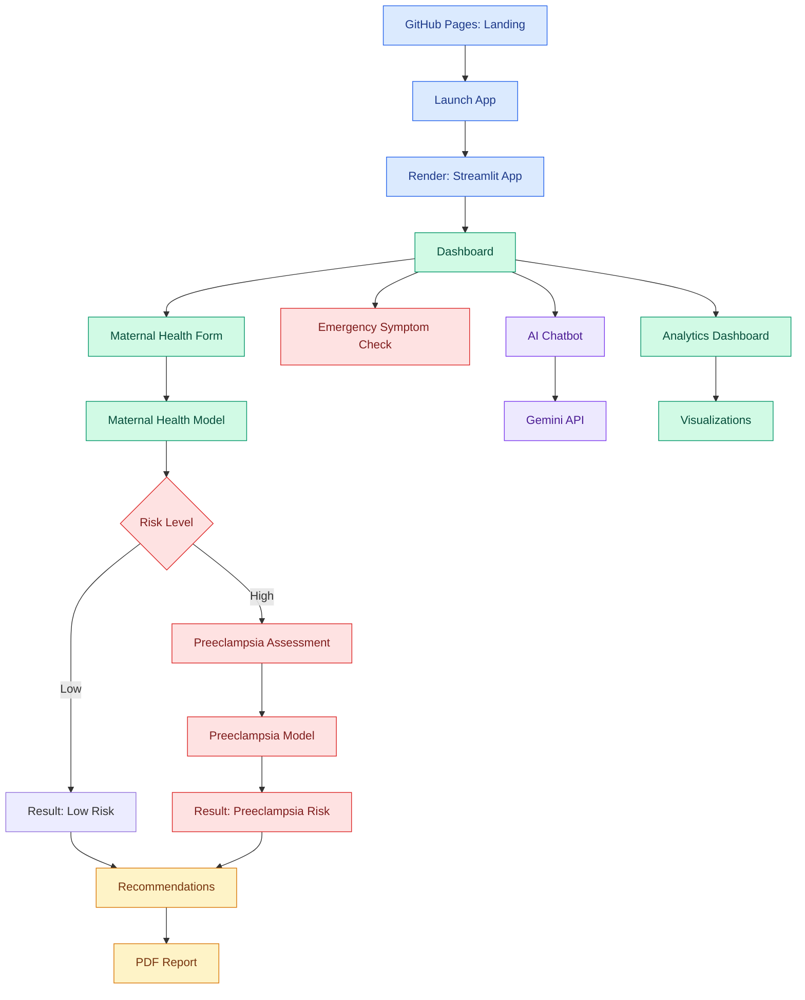

<div align="center">

# Preeclampsia Risk Prediction System
### A Machine Learning Approach to Maternal Health Screening

[](https://python.org)
[](https://streamlit.io)
[](https://scikit-learn.org)
[](https://ai.google.dev)
[](https://render.com)

**[Live Landing Page](https://priyankalisa.github.io/maternal-health-preeclampsia-system/) · [Launch App](https://maternal-health-preeclampsia-system.onrender.com/)**

</div>

---

## Table of Contents

1. [Overview](#overview)
2. [Why This Matters](#why-this-matters)
3. [How It Works](#how-it-works)
4. [Features](#features)
5. [Pipeline](#pipeline)
6. [Input Parameters](#input-parameters)
7. [Datasets](#datasets)
8. [Architecture](#architecture)
9. [Project Structure](#project-structure)
10. [What You'll Learn](#what-youll-learn)
11. [Disclaimer](#disclaimer)

---

## Overview

Preeclampsia is a pregnancy-related disorder that can escalate quickly and put both mother and baby at risk — yet with early screening, much of that risk is manageable. This project builds a two-stage machine learning system that flags maternal health risk first, then screens high-risk cases specifically for preeclampsia, wrapping the whole thing in an interactive Streamlit app with AI-assisted guidance.

It's built to demonstrate a complete healthcare ML product: data → models → deployed app → chatbot → report generation, not just a notebook with an accuracy score.

## Why This Matters

Preeclampsia and related maternal health complications are still under-detected in many settings, often due to:

- Diagnosis that comes too late in the pregnancy
- Uneven access to routine prenatal screening
- Gaps in continuous monitoring between visits
- Low awareness of risk factors and warning signs
- Delayed referral for medical intervention

A lightweight, accessible screening tool can help close some of that gap — this project is a step in that direction.

## How It Works

The system runs a **dual-stage assessment**:

| Stage | What Happens |
|---|---|
| **1. Intake** | The patient's clinical and demographic data is entered into the app |
| **2. Maternal Risk Model** | A trained model classifies overall maternal health risk |
| **3. Escalation Check** | If risk is high, the app automatically triggers a second, more specific assessment |
| **4. Preeclampsia Model** | A dedicated model estimates preeclampsia risk from additional clinical markers |
| **5. Guidance** | The app returns tailored recommendations and can generate a downloadable PDF report |

## Features

- **Maternal Health Risk Assessment** — first-line screening from clinical inputs
- **Preeclampsia Risk Prediction** — secondary, targeted screening for high-risk cases
- **PDF Report Generation** — a shareable summary of the assessment
- **Gemini-Powered Chatbot** — conversational support for maternal health questions
- **Emergency Symptom Flagging** — surfaces warning signs that need urgent attention
- **Personalized Recommendations** — advice tuned to the predicted risk level
- **Analytics Dashboard** — interactive charts for exploring risk patterns
- **Gauge-Style Risk Visuals** — quick, intuitive read on prediction outcomes
- **Cross-Device Layout** — usable on desktop, tablet, and mobile
- **Cloud-Hosted** — Streamlit app on Render, landing page on GitHub Pages

## Pipeline

```mermaid
flowchart LR
A[Raw Data] --> B[Cleaning]
B --> C[Feature Engineering]
C --> D[Preprocessing]
D --> E[Train / Test Split]
E --> F[Model Training]
F --> G[Evaluation]
G --> H[Model Selection]
H --> I[Serialization]
I --> J[Streamlit Deployment]
J --> K[Live Predictions]

classDef data fill:#FEF3C7,stroke:#D97706,stroke-width:1.5px,color:#78350F;
classDef model fill:#E0E7FF,stroke:#6366F1,stroke-width:1.5px,color:#312E81;
classDef deploy fill:#D1FAE5,stroke:#059669,stroke-width:1.5px,color:#064E3B;

class A,B data;
class C,D,E,F,G,H model;
class I,J,K deploy;
```



## Input Parameters

<table>
<tr>
<td valign="top" width="50%">

**Maternal Health Model**

| Feature | Notes |
|---|---|
| Age | Patient age |
| Gravida | Prior pregnancy count |
| Weight / Height | Anthropometric data |
| Gestation Period | Weeks pregnant |
| Blood Pressure | Systolic & diastolic |
| Anemia | Presence/absence |
| Albumin | Urine albumin level |
| Blood Sugar | Glucose reading |
| Fetal Position | Positional status |
| Fetal Heart Beat | BPM |
| Jaundice | Liver function marker |
| VDRL | Infection screening |
| HRsAG | Hepatitis marker |

</td>
<td valign="top" width="50%">

**Preeclampsia Model**

| Feature | Notes |
|---|---|
| Age | Maternal age (years) |
| Gravidity | Total pregnancies |
| Gestational Age | Weeks |
| Pre-Pregnancy BMI | Baseline BMI |
| Systolic BP | mmHg |
| Diastolic BP | mmHg |
| Hemoglobin | g/dL |
| Anemia Status | Presence/absence |
| Fasting Glucose | mg/dL |
| Proteinuria | Urine protein presence |
| HIV Status | Infection status |

</td>
</tr>
</table>

## Datasets

| Dataset | Source | Used For |
|---|---|---|
| **Zenodo Maternal Health Dataset** | [zenodo.org/records/14537882](https://zenodo.org/records/14537882) | Maternal Health Risk Model |
| **Africa Synthetic Maternal Health Dataset** | [HuggingFace](https://huggingface.co/datasets/electricsheepafrica/africa-synth-maternal-health-maternal-health-pregnancy-all) | Preeclampsia Risk Model |

The Zenodo set provides clinical and demographic records for general risk classification, while the Africa Synthetic set contributes pregnancy-specific lab measurements and history used for the more targeted preeclampsia model.

## Architecture



## Project Structure

```
maternal-health-preeclampsia-system/
├── app/
│   ├── app.py                      # Main Streamlit application
│   ├── chatbot.py                  # Gemini-powered chatbot logic
│   ├── cache.py                    # Performance caching layer
│   ├── doctor_advice.json          # Rule-based advice & thresholds
│   └── models/
│       ├── loader.py               # Model loading utility
│       ├── maternal_health_model.pkl
│       └── preeclampsia_model.pkl
├── .streamlit/
│   └── config.toml                 # UI theme & layout config
├── .vscode/
│   └── settings.json
├── index.html                      # GitHub Pages landing page
├── pyproject.toml                  # Dependencies & metadata
├── render.yaml                     # Render deployment config
├── uv.lock                         # Locked dependency versions
├── README.md
└── .gitignore
```

## What You'll Learn

Working through this project touches on:

- End-to-end ML workflow design
- Healthcare data preprocessing & feature engineering
- Model training, evaluation, and selection
- Deploying ML models through Streamlit
- Integrating a generative AI chatbot (Gemini API)
- Cloud deployment across two platforms (Render + GitHub Pages)
- Applying ML responsibly to a real-world healthcare context

## Disclaimer

> This project is built for **educational and research purposes only**. Its predictions are not medical advice, diagnoses, or treatment recommendations. Anyone with health concerns should consult a qualified healthcare professional.

---

<div align="center">
<sub>Built with Python, scikit-learn, and Streamlit</sub>
</div>
